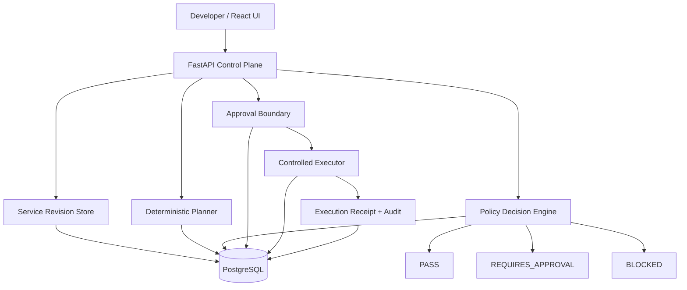

# PavedPath

[](https://github.com/Lawrencechew/pavedpath/actions/workflows/ci.yml)

PavedPath is a reference platform control plane that turns structured developer requests into deterministic policy decisions, governed approvals, and auditable controlled execution.

## The Problem

Platform teams need to offer self-service without letting stale or risky changes bypass governance.  
PavedPath demonstrates how a control plane can enforce that requests are evaluated, approved, and executed only when they still match the exact reviewed input.

## What PavedPath demonstrates

- structured service requests (`ServiceSpec`)
- deterministic planning and fingerprinting
- deterministic policy decisions (`PASS`, `REQUIRES_APPROVAL`, `BLOCKED`)
- explainable risk classification (`LOW`, `MEDIUM`, `HIGH`)
- persisted policy version evidence
- approval requirements derived from policy
- stale decision protection
- approval-to-fingerprint binding
- controlled server-side execution
- idempotent execution keying
- persisted execution receipts (success and failure)
- reconstructable lifecycle audit history
- PostgreSQL-backed CI validation

## Architecture



See [docs/architecture.md](docs/architecture.md), [docs/policy-decision-engine.md](docs/policy-decision-engine.md), and [docs/controlled-execution.md](docs/controlled-execution.md).

## Control-plane guarantees

| Guarantee | Enforcement |
| --- | --- |
| Policy decisions are deterministic | Server-side deterministic policy engine |
| Decisions are reproducible | Policy version persisted on each decision |
| BLOCKED changes cannot progress | API enforces policy outcome gates |
| Changed requests cannot reuse old decisions | Stale-decision detection and fingerprint checks |
| Approval applies to exactly what was reviewed | Approval rows bind to plan fingerprint |
| Duplicate execution is controlled | Deterministic execution key + DB uniqueness |
| Failed execution evidence is retained | Persisted `FAILED` execution records with error info |
| Completed evidence is not mutable CRUD state | No update/delete execution endpoints |
| Lifecycle can be reconstructed | Persisted audit events and linked execution receipt data |

## Why no LLM in authorization

Authorization and policy gating are deterministic and reproducible by design.  
LLMs may be useful in future for guidance or documentation assistance, but they are intentionally not part of the policy/approval/execution authorization path.

## Implemented vs intentionally out of scope

### Implemented

- local/reference control plane
- deterministic policy evaluation and approvals
- controlled execution semantics
- execution receipts and lifecycle audit evidence
- PostgreSQL persistence + GitHub CI validation

### Intentionally out of scope

- Terraform/cloud provisioning execution
- Kubernetes/AKS deployment
- enterprise IAM/OAuth/OIDC
- distributed queues/workflow engines
- production hosting
- LLM-based authorization

These are deliberate portfolio boundaries, not hidden defects.

## Repository structure

- [app/](app/) - FastAPI control-plane domain and API logic
- [migrations/](migrations/) - Alembic schema migrations
- [tests/](tests/) - policy, approval, and execution lifecycle tests
- [frontend/](frontend/) - React demo UI for request/plan/approval/execution flow
- [docs/](docs/) - architecture and design documentation
- [.github/workflows/](.github/workflows/) - CI workflow definitions

## Validation

### Backend (local)

```bash
python -m pytest -q
```

### Database migration

```bash
python -m alembic upgrade head
```

### Frontend

```bash
cd frontend
npm ci
npm run build
```

### PostgreSQL-backed validation (recommended)

Use the repository CI workflow (or equivalent local Postgres setup) so lifecycle tests run against PostgreSQL, not only SQLite defaults.

## CI evidence

Latest portfolio closeout run (at time of update):

- Workflow: `CI - Public v1`
- Run ID: `32806300580`
- Commit: `8ef2d96dba917526efae0d9e46a4853a0b0460a4`
- Result: `success`

## Security boundary note

PavedPath demonstrates control-state governance (policy + approval + execution eligibility).  
It does not claim to implement full production security architecture or enterprise identity federation in this repository.
