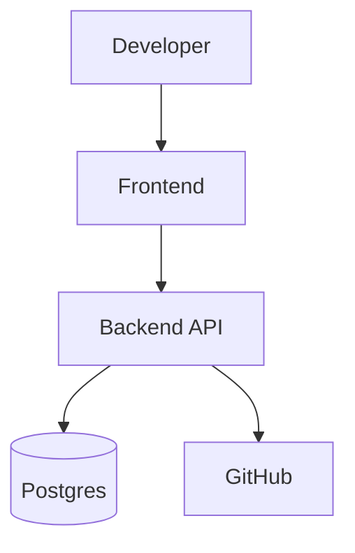

## Architecture Overview

This document describes the high-level architecture implemented in PavedPath (v1).

flowchart LR
    Dev[Developer Intent] --> Spec[ServiceSpec]
    Spec --> Policy[Policy Validation]
    Policy --> Planner[Deterministic Planner]
    Planner --> Plan[Plan + Diff]
    Plan --> Review[Approval]
    Review --> Git[Git Handoff]
    Git --> CI[CI/CD]
    CI --> AKS[Azure / AKS]

Components
- `app/` — FastAPI backend providing endpoints to create users, submit specs, generate plans, and record approvals.
- `planner` — deterministic artifact generation and plan creation persisted as `ServiceRevision` and `Plan` records.
- `policies` — rule checks applied during plan generation (replicas, resource limits, probes, etc.).
- `migrations/` — Alembic-managed schema for PostgreSQL persistence.
- `frontend/` — React SPA demonstrating the end-to-end flow: Create → Validate → Plan → Review → Approve → Mock Git handoff.

Persistence model (summary)
- `Service` — logical service with many `ServiceRevision` entries.
- `ServiceRevision` — snapshot of a ServiceSpec, fingerprinted for determinism.
- `Plan` — generated from a revision; contains artifacts and status (READY, APPROVED, SUPERSEDED).
- `Approval` — binds a user to a plan and its revision fingerprint.
- `AuditEvent` — append-only events recording major actions.

Notes
- Git handoff and CI/CD are demo/mocked in this repository; the project demonstrates the boundaries rather than a full production integration.
# PavedPath Architecture (v1)

Mermaid diagrams and high-level description of the architecture.

