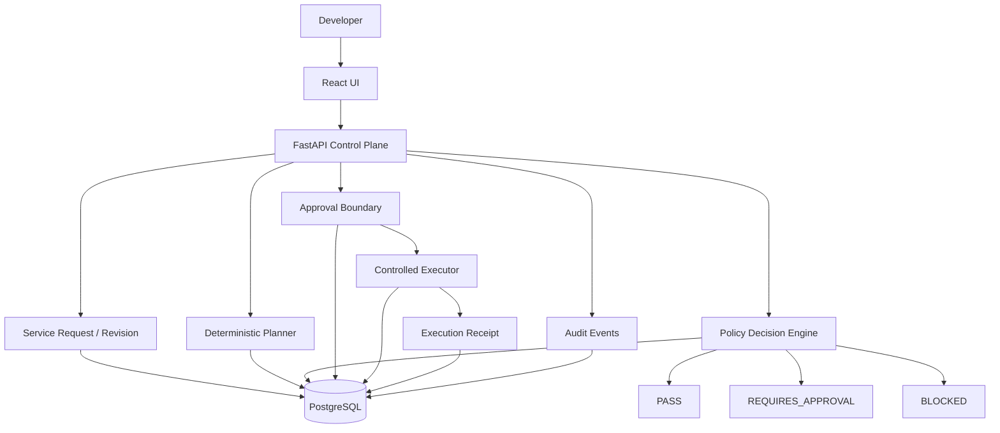

# PavedPath Architecture

PavedPath is a reference control plane that governs request -> policy -> approval -> execution with deterministic server-side decisions and persistent evidence.

## Core components

- `app/main.py` - API boundaries for spec submission, planning, approval, and execution.
- `app/policy_engine.py` - deterministic policy/risk evaluation (`PASS`, `REQUIRES_APPROVAL`, `BLOCKED`).
- `app/planner.py` - deterministic planning and fingerprint-based revision binding.
- `app/executor.py` - deterministic local executor abstraction for controlled execution.
- `migrations/` - Alembic migration chain for persistent evidence models.
- `tests/` - lifecycle tests covering policy, approvals, idempotency, execution receipts, and audit behavior.

## Persistence summary

- `services`, `service_revisions` - request/revision lineage.
- `plans` - deterministic plan records and lifecycle state.
- `policy_decisions` - persisted policy outcomes, reasons, risk, version, and staleness.
- `approvals` - reviewer approval records bound to plan fingerprint.
- `executions` - controlled execution records, idempotency key, status, and receipt.
- `audit_events` - lifecycle traceability.
