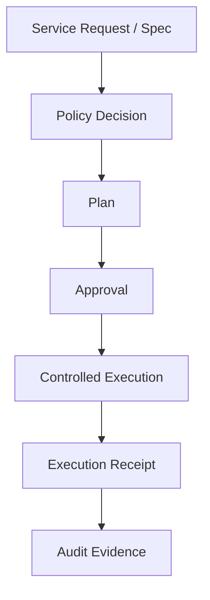

# Controlled Execution (Phase 6)

## Execution boundary

PavedPath executes only after policy + approval gates are satisfied. Execution is a server-side control-state decision, not a frontend decision.

## Lifecycle

## Preconditions

Execution is rejected unless all are true:

- plan exists and is approved/current
- policy decision exists and is not stale
- policy outcome is not `BLOCKED`
- approval count satisfies policy-required approvals
- approval fingerprint matches plan fingerprint
- latest service revision fingerprint still matches approved plan

## Approval binding

Execution binds to:

- `plan_id`
- `policy_decision_id`
- `policy_version`
- `input_fingerprint`
- fingerprint-bound approval snapshot (`approval_ids`, count)

This prevents approval for revision A from authorizing execution of revision B.

## Idempotency strategy

One logical execution record is created per deterministic execution key:

`hash(plan_id + fingerprint + policy_decision_id + policy_version)`

Duplicate execution requests return the same persisted execution record instead of creating duplicate successful executions.

## Failure behavior

- deterministic executor supports explicit simulated failure (`execution.simulateFailure`)
- failed executions are persisted with terminal status and error information
- historical failed evidence remains queryable

## Receipt/evidence model

Each terminal execution stores a receipt with:

- execution ID
- plan ID
- service revision ID
- policy decision ID/version
- approval snapshot
- input fingerprint
- executor type/version
- status + timestamps
- summary/error + metadata

## Executor abstraction

`LocalDeterministicExecutor.execute(approved_plan_spec)` is the current reference executor.

It has no cloud/provider dependencies and represents the future extension point for real provisioning/deployment backends.

## Production extension points (deferred)

- cloud executor adapters
- stronger authN/authZ role enforcement
- asynchronous orchestration/backoff/retry infrastructure
- external deployment integration
